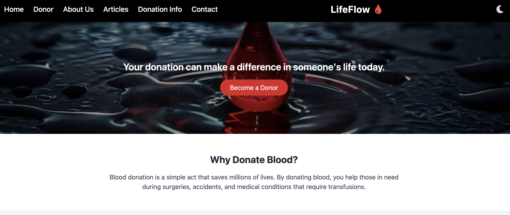
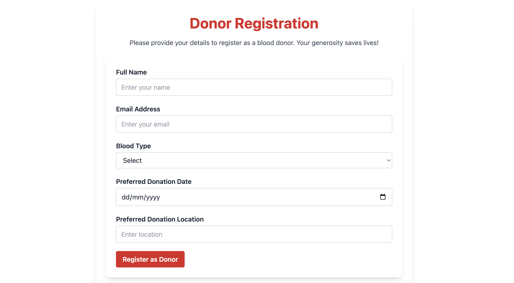
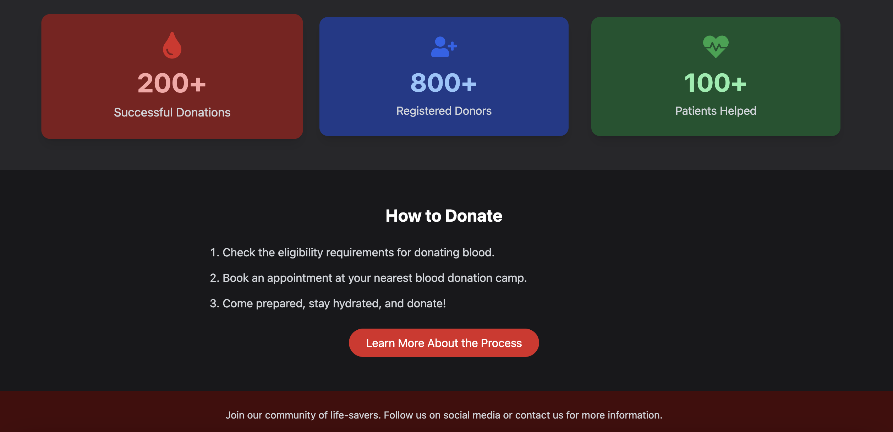

# LifeFlow 🩸

LifeFlow is a modern, responsive frontend web application built using **React** and **Tailwind CSS**, aimed at simplifying blood donation registration and spreading awareness. With features like dark mode, mobile-friendly navigation, and modular pages, it offers a user-friendly interface for donors and organizations.

## 🖼️ Screenshots

### Home Page


### Donor Registration


### 🌙 Dark Mode  


## 🌟 Features

- 🔥 Clean, modern UI with Tailwind CSS
- 🌙 **Dark Mode** toggle
- 📱 Fully responsive design
- 📌 Sidebar-style navigation for mobile
- 📋 Donor registration form
- 📊 Stats with animation using Framer Motion
- 📰 Articles and blood donation info pages

## 🛠️ Tech Stack

- **React.js**
- **Tailwind CSS**
- **React Router**
- **Framer Motion**
- **React Icons**


## Run Locally

Clone the project.


Go to the project directory:

```bash
cd LifeFlow/client
```

Install dependencies

```bash
  npm install
```

Start the server

```bash
  npm run start
```

Runs the app in the development mode.

Open http://localhost:3000 to view it in your browser.


## License

[MIT](https://choosealicense.com/licenses/mit/)


## Authors

- [@meghagoswami](https://www.github.com/megha-2461)


